# AttnGAN-revision and demos

This is AttnGAN revised version for Google Colab.

Refer to [https://github.com/taoxugit/AttnGAN](https://github.com/taoxugit/AttnGAN) for original source version,  
it is implementation for the paper [AttnGAN: Fine-Grained Text to Image Generation with Attentional Generative Adversarial Networks](http://openaccess.thecvf.com/content_cvpr_2018/papers/Xu_AttnGAN_Fine-Grained_Text_CVPR_2018_paper.pdf).

Refer to troubleshooting [issues](https://github.com/rightlit/AttnGAN-rev/issues) while running with original source code. 

### Dependencies
python 3.6

Pytorch 1.7.0+cu101

**Data**

1. Download preprocessed metadata for [birds](https://drive.google.com/open?id=1O_LtUP9sch09QH3s_EBAgLEctBQ5JBSJ) and [flowers](https://drive.google.com/open?id=0B3y_msrWZaXLaUc0UXpmcnhaVmM) and save them to `data/`
2. Download the [birds](http://www.vision.caltech.edu/visipedia/CUB-200-2011.html) image data. Extract them to `data/birds/`
3. Download the [flowers](http://www.robots.ox.ac.uk/~vgg/data/flowers/102/) image data. Extract them to `data/flowers/`

**Sampling**
- Run `python main.py --cfg cfg/eval_bird.yml --gpu 1` to generate examples from captions in files listed in "./data/birds/example_filenames.txt". 
- Run `python main.py --cfg cfg/eval_flower.yml --gpu 1` to generate examples from captions in files listed in "./data/flowers/example_filenames.txt". 

**Examples generated by AttnGAN**

 bird example              |  bird example
:-------------------------:|:-------------------------:
the medium sized bird has a dark grey color, a black downward curved beak, and long wings. | the bird is dark grey brown with a thick curved bill and a flat shaped tail.
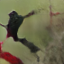 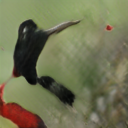 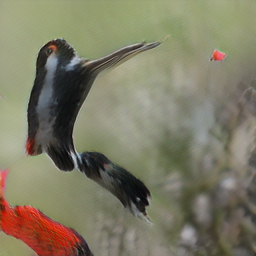 | 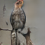 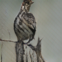 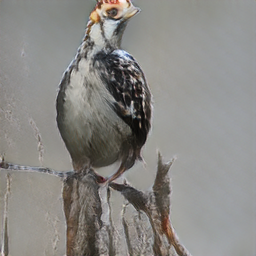
bird has brown body feathers, white breast feathers and black beak | this bird has a dark brown overall body color, with a small white patch around the base of the bill.
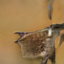 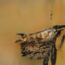 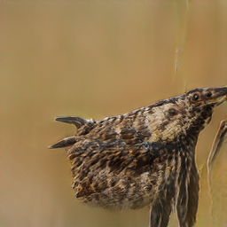 | 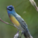 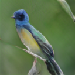 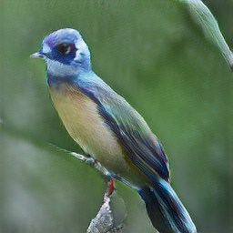
the bird has very long and large brown wings, as well as a black body and a long black beak. | it is a type of albatross with black wings, tail, back and beak, and has a white ring at the base of its beak.
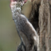 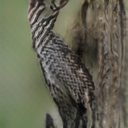 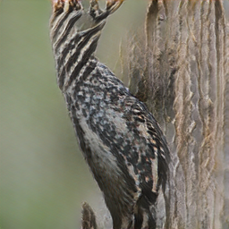 | 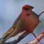 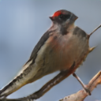 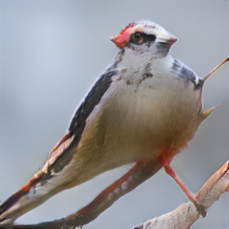
this bird has brown plumage and a white ring at the base of its long, curved brown beak. | the entire body is dark brown, as is the bill, with a white band encircling where the bill meets the head.
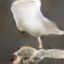 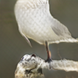 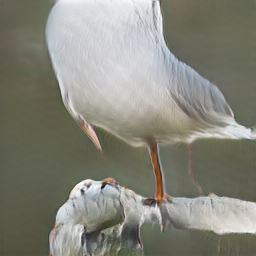 | 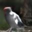 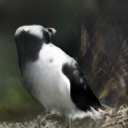 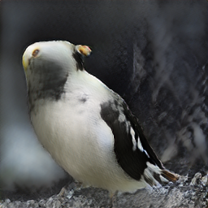
this bird is gray in color, with a large curved beak. | a large gray bird with a long wingspan and a long black beak.
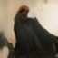 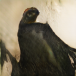 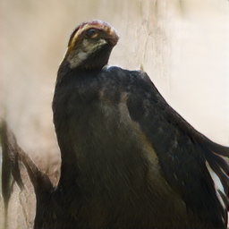 | 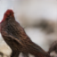 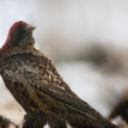 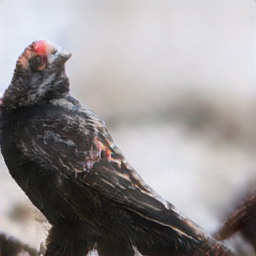

 flower example              |  flower example
:-------------------------:|:-------------------------:
the petals of the flower are pink in color and have a yellow center. | this flower is pink and white in color, with petals that are multi colored.
 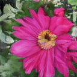 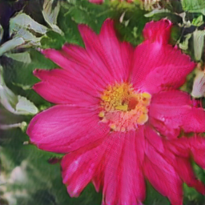 |  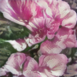 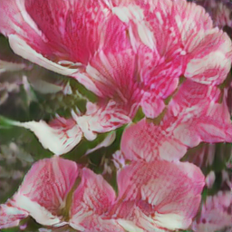
the geographical shapes of the bright purple petals set off the orange stamen and filament and the cross shaped stigma is beautiful. | the purple petals have shades of white with white anther and filament
  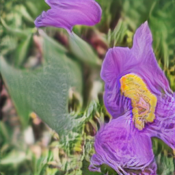 |  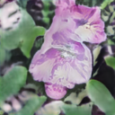 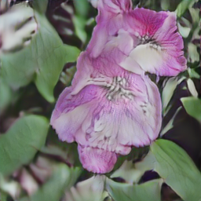
this flower has large pink petals and a white stigma in the center | this flower has petals that are pink and has a yellow stamen
 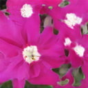 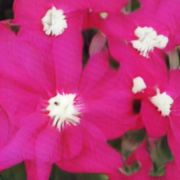 |  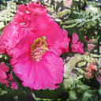 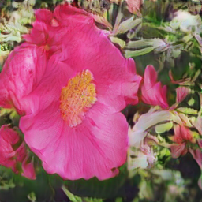
a flower with short and wide petals that is light purple. | this flower has small pink petals with a yellow center.
 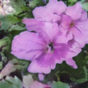 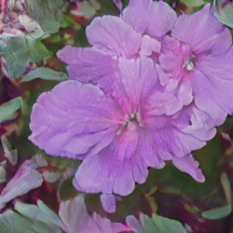 |  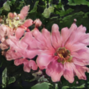 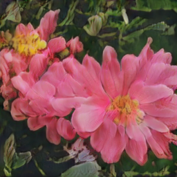
this flower has large rounded pink petals with curved edges and purple veins. | this flower has purple petals as well as a white stamen.
 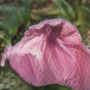 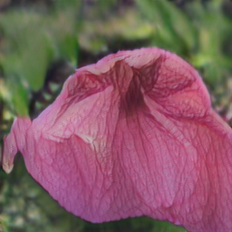 |  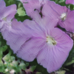 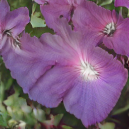

coco example              |  coco example
:-------------------------:|:-------------------------:
This wire metal rack holds several pairs of shoes and sandals  | A dog sleeping on a show rack in the shoes.
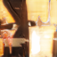   |   
Various slides and other footwear rest in a metal basket outdoors.  | A small dog is curled up on top of the shoes
   |   
a shoe rack with some shoes and a dog sleeping on them  | A motorcycle parked in a parking space next to another motorcycle.
   |   
An old motorcycle parked beside other motorcycles with a brown leather seat.  | Motorcycle parked in the parking lot of asphalt.
   |   
A close up view of a motorized bicycle, sitting in a rack.  | The back tire of an old style motorcycle is resting in a metal stand.
   |   

**Reference**

- [StackGAN++: Realistic Image Synthesis with Stacked Generative Adversarial Networks](https://arxiv.org/abs/1710.10916) [[code]](https://github.com/hanzhanggit/StackGAN-v2)
- [Unsupervised Representation Learning with Deep Convolutional Generative Adversarial Networks](https://arxiv.org/abs/1511.06434) [[code]](https://github.com/carpedm20/DCGAN-tensorflow)
