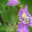
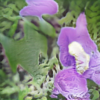
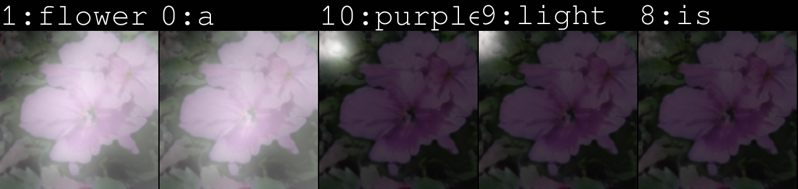

# AttnGAN-revision for Colab

This is AttnGAN revised version for Google Colab.

Refer to [https://github.com/taoxugit/AttnGAN](https://github.com/taoxugit/AttnGAN) for original source version.

Refre to [troubleshooting](https://github.com/rightlit/AttnGAN-rev/issues) while executing in origina source code. 

### Dependencies
python 3.6

Pytorch 1.7.0+cu101

**Data**

1. Download our preprocessed metadata for [birds](https://drive.google.com/open?id=1O_LtUP9sch09QH3s_EBAgLEctBQ5JBSJ) [coco](https://drive.google.com/open?id=1rSnbIGNDGZeHlsUlLdahj0RJ9oo6lgH9) and save them to `data/`
2. Download the [birds](http://www.vision.caltech.edu/visipedia/CUB-200-2011.html) image data. Extract them to `data/birds/`
3. Download the [flowers](http://www.robots.ox.ac.uk/~vgg/data/flowers/102/) image data. Extract them to `data/flowers/`
4. Download [coco](http://cocodataset.org/#download) dataset and extract the images to `data/coco/`

**Training**
- Pre-train DAMSM models:
  - For bird dataset: `python pretrain_DAMSM.py --cfg cfg/DAMSM/bird.yml --gpu 0`
  - For flower dataset: `python pretrain_DAMSM.py --cfg cfg/DAMSM/flower.yml --gpu 0`
 
- Train AttnGAN models:
  - For bird dataset: `python main.py --cfg cfg/bird_attn2.yml --gpu 0`
  - For flower dataset: `python main.py --cfg cfg/flower_attn2.yml --gpu 0`

- `*.yml` files are example configuration files for training/evaluation our models.

**Pretrained Model**
- [DAMSM for bird](https://drive.google.com/open?id=1GNUKjVeyWYBJ8hEU-yrfYQpDOkxEyP3V). Download and save it to `DAMSMencoders/`
- [DAMSM for coco](https://drive.google.com/open?id=1zIrXCE9F6yfbEJIbNP5-YrEe2pZcPSGJ). Download and save it to `DAMSMencoders/`
- [AttnGAN for bird](https://drive.google.com/open?id=1lqNG75suOuR_8gjoEPYNp8VyT_ufPPig). Download and save it to `models/`
- [AttnGAN for coco](https://drive.google.com/open?id=1i9Xkg9nU74RAvkcqKE-rJYhjvzKAMnCi). Download and save it to `models/`

- [AttnDCGAN for bird](https://drive.google.com/open?id=19TG0JUoXurxsmZLaJ82Yo6O0UJ6aDBpg). Download and save it to `models/`
  - This is an variant of AttnGAN which applies the propsoed attention mechanisms to DCGAN framework. 

**Sampling**
- Run `python main.py --cfg cfg/eval_bird.yml --gpu 1` to generate examples from captions in files listed in "./data/birds/example_filenames.txt". Results are saved to `DAMSMencoders/`. 
- Run `python main.py --cfg cfg/eval_flower.yml --gpu 1` to generate examples from captions in files listed in "./data/flowers/example_filenames.txt". Results are saved to `DAMSMencoders/`. 
- Change the `eval_*.yml` files to generate images from other pre-trained models. 
- Input your own sentence in "./data/birds/example_captions.txt" if you wannt to generate images from customized sentences. 

**Examples generated by AttnGAN [[Blog]](https://blogs.microsoft.com/ai/drawing-ai/)**

 bird example              |  bird example
:-------------------------:|:-------------------------:
the medium sized bird has a dark grey color, a black downward curved beak, and long wings. | the bird is dark grey brown with a thick curved bill and a flat shaped tail.
   |   
  | 
bird has brown body feathers, white breast feathers and black beak | this bird has a dark brown overall body color, with a small white patch around the base of the bill.
   |   
  | 
the bird has very long and large brown wings, as well as a black body and a long black beak. | it is a type of albatross with black wings, tail, back and beak, and has a white ring at the base of its beak.
   |   
  | 
this bird has brown plumage and a white ring at the base of its long, curved brown beak. | the entire body is dark brown, as is the bill, with a white band encircling where the bill meets the head.
   |   
  | 
this bird is gray in color, with a large curved beak. | a large gray bird with a long wingspan and a long black beak.
   |   
  | 

 flower example              |  flower example
:-------------------------:|:-------------------------:
the petals of the flower are pink in color and have a yellow center. | this flower is pink and white in color, with petals that are multi colored.
   |   
  | 
the geographical shapes of the bright purple petals set off the orange stamen and filament and the cross shaped stigma is beautiful. | the purple petals have shades of white with white anther and filament
   |   
  | 
this flower has large pink petals and a white stigma in the center | this flower has petals that are pink and has a yellow stamen
   |   
  | 
a flower with short and wide petals that is light purple. | this flower has small pink petals with a yellow center.
   |   
  | 
this flower has large rounded pink petals with curved edges and purple veins. | this flower has purple petals as well as a white stamen.
   |   
  | 

**Validation**
- To generate images for all captions in the validation dataset, change B_VALIDATION to True in the eval_*.yml. and then run `python main.py --cfg cfg/eval_bird.yml --gpu 1`
- We compute inception score for models trained on birds using [StackGAN-inception-model](https://github.com/hanzhanggit/StackGAN-inception-model).
- We compute inception score for models trained on coco using [improved-gan/inception_score](https://github.com/openai/improved-gan/tree/master/inception_score).

**Reference**

- [StackGAN++: Realistic Image Synthesis with Stacked Generative Adversarial Networks](https://arxiv.org/abs/1710.10916) [[code]](https://github.com/hanzhanggit/StackGAN-v2)
- [Unsupervised Representation Learning with Deep Convolutional Generative Adversarial Networks](https://arxiv.org/abs/1511.06434) [[code]](https://github.com/carpedm20/DCGAN-tensorflow)
